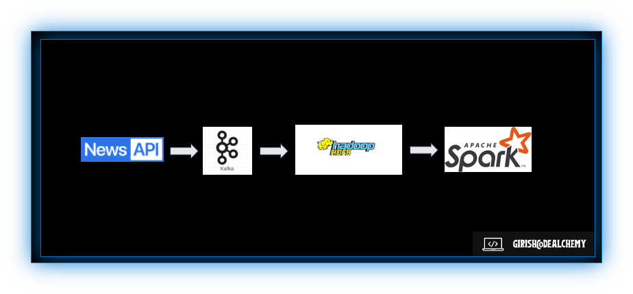
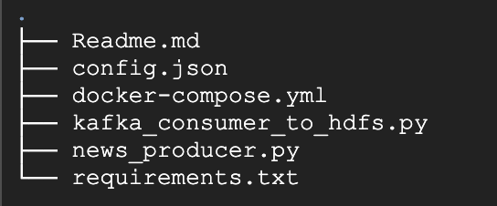

# Sentiment Analysis for News with ETL Pipeline using Kafka, Hadoop, and Spark

<p align="center">
    
</p>

Utilizing the power of Hadoop, Apache Spark and machine learning, we analyze News content to determine underlying sentiments.

This Readme.md will walk you through the entire process, from setting up data streaming with Zookeeper and Kafka, to using Spark for data processing and machine learning for sentiment classification

# Flow diagram


## Prerequisites

- Python 3.x
- [News API](https://newsapi.org) key
- Apache Kafka installed and running (Standalone or Containerized)
- HDFS and Apache Spark configured
- Python library (`kafka-python`,`hdfs`, `newsapi-python`) installed

## Project Structure



- **Requirements: `requirements.txt`**

  - Installing required packages to run the project

- **Producer: `news_producer.py`**

  - Fetches news articles from NewsAPI based on user input.
  - Publishes the news data to a Kafka topic.

- **Consumer: `kafka_consumer_to_hdfs.py`**

  - Consumes news data from a Kafka topic.
  - Writes the news data to HDFS.

- **Configuration: `config.json`**
  - Configure NewsAPI key, Kafka bootstrap servers, and topic details.
  - Configure hdfs url and path details
    ```json
    {
      "newsapi": {
        "key": "your_newsapi_key",
        "api_page_size": 100,
        "source": "bbc-news,cnn,fox-news,nbc-news,the-guardian-uk,the-new-york-times,the-washington-post,usa-today,independent,daily-mail"
      },
      "kafka": {
        "bootstrap_servers": "localhost:9092",
        "topic": "news-topic"
      },
      "hdfs": {
        "url": "http://namenode:9870",
        "path": "/user/spark",
        "file_name": "news_data_articles.txt"
      }
    }
    ```

## Setup

1. Install required Python packages:

   ```bash
   pip install -r requirements.txt
   ```

2. Set up your News API key:

   Generate or fetch the news api from https://newsapi.org/account

3. Update the Configurations in the config.json:

   - News api
   - kafka broker and topics
     - Create the topic if not present
       ```bash
       kafka-topics --create --topic news-topic --bootstrap-server localhost:9092 --partitions 1 --replication-factor 1
       ```
   - HDFS url, path and filename

4. Run Docker Compose to start Kafka and Zookeeper:

   `Please ensure Docker and Docker Compose are installed before running the command.`

   ```bash
   docker-compose up -d
   ```

| Service | URL                                      |
| ------- | ---------------------------------------- |
| Hadoop  | [Hadoop UI](http://localhost:9870)       |
| Spark   | [Spark Master UI](http://localhost:4040) |
| Jupyter | [Jupyter UI](http://localhost:8888)      |

## Usage

1. **Run the NewsAPI Kafka producer:**

   ```bash
   python news_producer.py
   ```

   - Enter a News keyword to fetch articles from NewsAPI.
   - Type 'exit' to quit the producer.

2. **Run the Kafka consumer and write it to HDFS:**

   ```bash
   python kafka_consumer_to_hdfs.py
   ```

   - Consumes messages from the Kafka topic.
   - Writes news data to HDFS in JSON format.

3. **Verify the data in HDFS**

   ```bash
   hdfs dfs -ls /user/spark/
   hdfs dfs -head /user/spark/news_data_articles.txt
   ```

   - NewsArticle Data is stored in HDFS

4. **Loading the HDFS data to spark for Machine learning analysis**

   [Open Notebook](./spark-notebooks/workspace/spark-MulticlassClassification-analysis.ipynb)

   - Spark analysis is done on the news article stored on hdfs and prediction is stored in the output for future analysis
